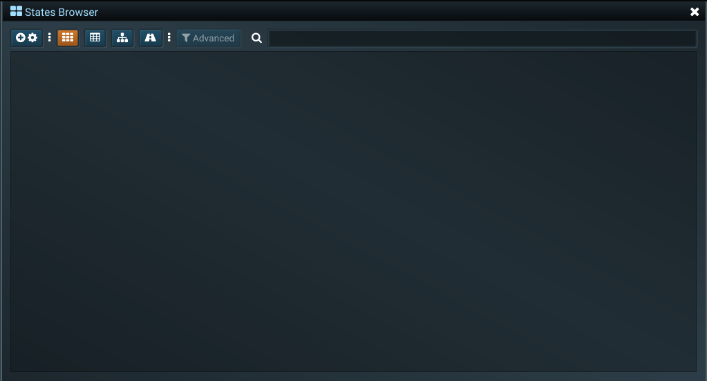
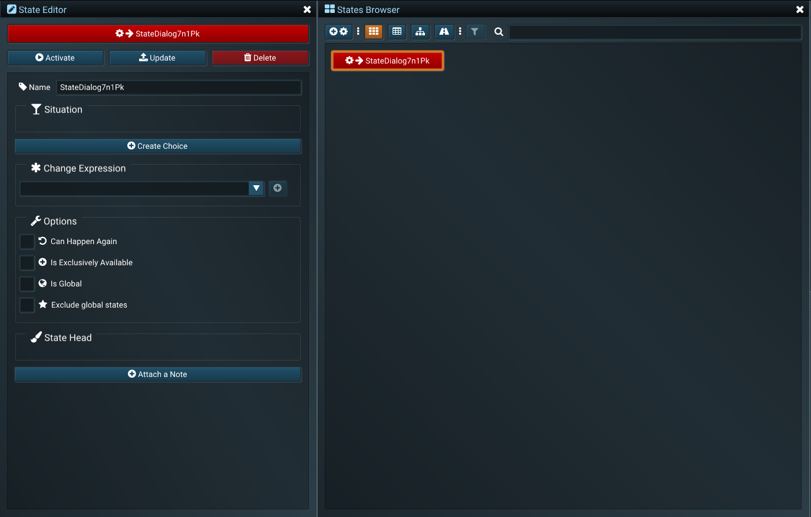

# Nonlinear System Tools
## Overview
Interactive stories require the one who reads to make a choice. Choices make the story take a turn for the better or for the worse. NST is a full suite of tools for creating, analyzing and rendering branching or nonlinear stories, novels, poems, generic text or even other media such as music or films.

NST aims to provide authors with tools which keep a linear level of complexity, regardless of the number of branching paths the story might contain. When using **[Twine](https://twinery.org/)**, **[Ink](https://www.inklestudios.com/ink/)** or other similar tools, the branching gets more difficult with every new branch an author creates, just because of the nature of dragging lines on a graph or referencing labels in a script. NST manages to overcome this particular issue by using innovative ways of connecting specific moments of time inside the story by taking away explicit connections and relying on discrete conditions under which something can happen.

NST consists of an Editor and a Reader, which are separate standalone programs. The NST Editor helps authors in creating nonlinear or branching stories, which then can be read inside the NST Reader. 

## Concepts
### &#xf085; Systems
A &#xf085; **system** or a **story** is a **project** created inside NST. Creating a new story in NST means creating a new project. Each system has only 2 components: &#xf013; **states** and &#xf02d; **properties**. Systems are completely deterministic.
### &#xf013; States
A &#xf013; **state** is a single moment in time in a story. One story has only one active state at every moment, which describes what's the situation at that point in time. The state can be activated by a player choice, may it be active or passive. Each story has a single &#xf061; **entry state** which describes the starting point of the story. The state may be available based on the state's &#xf0cb; **availability expression**. The  &#xf0cb; availability expression describes what needs to have happened in the story for the state to become a choice for the one who interacts. For example, one can drive a car if he had previously at some point bought a car. This is a relationship specified in the state's &#xf0cb; availability expression. When a state becomes active (a player makes a choice) it can change a property value using the &#xf069; **change expressions**.  
### &#xf02d; Properties
A &#xf02d; **property** is a named numeric value which can be used inside expressions. For example, a property may hold a character's health, whether a character has an item or not, an item's damage value, the relationship status between two characters, and so on. &#xf013; States may use &#xf02d; property values inside &#xf0cb; **availabilty expressions** to determine whether they are available (for example, a &#xf013; state in which a character dies if his health is equal to 0), or inside the &#xf069; **change expressions** (for example, a character swings his sword and inflicts 20 damage to another character's health). 
### &#xf06c; Branches
A &#xf06c; **branch** is a special type of component in a system which tracks what has already happened (the order of activation of states). This allows authors to rewind the time or advance it forwards. Branches can also be saved and reloaded later.
# NST Editor
## Quick Start Guide
In this guide we will create a simple branching story to demonstrate capabilities of the NST Editor. This story is called Spook's Adventures, and is also available on the &#xf1b7; Steam Workshop and is also showcased in some of the trailer videos. The main character (Spook) finds himself in a New York alley, chased by cops. He will have 3 choices. His choices will be: to charge the cops, to run for it eastwards, or to take the stairs inside an apartment. 2 of the choices will lead to him being arrested in 2 different ways, and the third one will give Spook 2 additional choices. We will implement this mini story using the NST Editor.
### Creating Stories
When starting NST Editor for the first time, a new story is automatically created. You can also create a new story by going to **&#xf15b; File > &#xf067; New**. To give a name to the story you have to save it first. To save a story with a new name go to the menu **Story[Name] > &#xf0c7; Save As > [Enter a Name] > &#xf00c; Confirm**. This will save the story inside the **[Root Folder]/stories** folder. 
>[!TIP]
To load a story go to the menu **&#xf15b; File > &#xf07c; Load**, which lists all the availabile stories inside the **[Root Folder]/stories** folder. You can quickly open the stories folder by clicking on **&#xf15b; File > &#xf07c; Stories Folder**. 
### Using States
To create a new &#xf013; state in the story you can use the &#xf009; States Browser window, which is located under **&#xf2d0; Window > &#xf009; States Browser**. The &#xf009; States Browser in an empty story is shown on the image below. You can move and dock this window by clicking and dragging the title.

Clicking on the **&#xf055;&#xf013;** button on the far left will create a new state. 

>[!TIP]
Another way of creating states is by going to the menu **&#xf085; System > &#xf055; Create > &#xf013; State**.

Each &#xf013; state in the &#xf009; States Browser window is represented by a clickable button. To edit a &#xf013; state you have to right-click it and select &#xf044; **Edit** which will automatically open the &#xf044; **State Editor** window. The image below shows the &#xf044; State Editor and the &#xf009; States Browser side by side.

You can edit all internal state properties in the &#xf044; State Editor. All edits are propagated inside the system by hitting the **&#xf093; Update** button.
>[!WARNING]
Selecting another state will **not** automatically update the changes on the current state. You must hit the **&#xf093; Update** button to propagate the changes.

&#xf02b; Rename the newly created state to *SpookEntersAlley* and **&#xf093; Update** the state.

The state situation describes what is happening in the current moment in time. You can right-click on the situation and choose **Edit With > Notepad**. A new Notepad window will open inside the NST Editor. You can move and dock the Notepad window just as you move and dock all other windows. To propagate the text you have written inside Notepad to the NST Editor, just hit Save (or ctrl+s). 

In the situation field for the *SpookEntersAlley* state enter the following text:

>You steer into a dark New York alley. Northwards, you see police officers coming towards you. They have police dogs with them in an attempt to track you down. Eastwards you see another alley, and with it comes a chance to run for it. Westwards you have a fire escape which you may attempt to climb. What is your next step?

The State Editor window should look like the image below.

### Using Properties
## Reference
### States Browser
### State Editor
All states are uniquely identified by their name. A state's name must be unique and must not contain any special characters, reserved words or empty spaces. These rules exist because names are used inside expressions to identify the states.

>[!NOTE]
Updating the same state with a different name will effectively trigger a rename. A state rename will warn the user if a name exists or if the name contains an illegal word or character.

>[!TIP]
You can view warnings and errors inside the **&#xf1c9; Log** window located under **&#xf2d0; Window > Editor Utilities > &#xf1c9; Log**. The last logged message is shown in the top right corner of the title bar for a couple of seconds after it happens.
### Property Editor
### Read in Editor
### Content Browser
### Time Controller
### Note Editor
### Steam Workshop
### Log
### Profiler
### Command History
### Syncing Reader
### Settings
## Files
### NTX
### NTS
### XML
# NST Reader
## Loading Stories
## Reading Stories
# Changelog
> [!NOTE]
Last Updated: 5 October 2021